# 헬스앱 디자인·문구 감사 보고서

- **대상**: 라이브 앱 `https://fitness-exercises-iota.vercel.app` (배포 버전 **v47**)
- **작성일**: 2026-08-08
- **성격**: 진단 전용. **코드는 한 줄도 고치지 않았습니다.** 이 문서와 스크린샷만 만들었습니다.
- **스크린샷**: `docs/research/design-audit/` 폴더 (27장)
- **목표**: "정신없고 복잡한 느낌"의 원인을 찾아 **덜어내기 중심**으로 정돈. AI 티가 덜 나는, 심플하지만 세련된 화면. 구조·사용법은 그대로 둡니다(전면 리디자인 아님).

---

## 0. 한눈에 보기 (결론 먼저)

**정신없어 보이는 진짜 원인은 "정보가 많아서"가 아니라, 아래 3가지입니다.**

1. **화면에 있는 글자 조각의 약 70~90%가 11px 이하 잔글씨**라서 위계가 사라졌습니다(홈·기록·세션 89%). 큰 숫자 하나가 눈에 들어오는 게 아니라, 작은 설명이 사방에서 동시에 말을 겁니다.
2. **같은 사실을 두 번, 세 번 보여줍니다.** (같은 주간 횟수를 두 카드가 다르게 셈 / 예시 문장과 예시 버튼이 나란히 / "API 키 필요"가 한 화면에 3번)
3. **이모지 37종이 SVG 아이콘 31종 위에 덧칠**돼 있습니다. 잘 만든 아이콘 세트가 있는데 그 위에 ✨🟡🔥🎉를 얹어서, 딱 "AI가 만든 화면" 느낌이 납니다.

> **한 줄 처방**: 새로 그리지 말고 **지우세요.** 잔글씨 30%, 이모지 대부분, 중복 카드 5개를 덜어내면 같은 구조 그대로 훨씬 세련돼집니다.

---

## 1. 조사 방법

| 항목 | 내용 |
|---|---|
| 방식 | Orca 내장 브라우저로 라이브 앱을 **폰 크기(가로 393px)** 화면에 띄워 직접 조작 |
| 화면 수 | 탭 5개 + 흐름 화면 12개 + 오버레이 10개 = **27장 캡처** |
| 코드 대조 | 라이브에서 내려받은 `js/*.js`·`css/styles.css`(v47)와 1:1 대조 |
| 측정 | 화면별 길이·박스 수·글자 크기 분포·강조색 개수를 브라우저에서 실측 |

**주의 (읽기 전 꼭)**: 캡처 환경(리눅스)에 이모지 글꼴이 없어서, 스크린샷에서 **이모지가 네모(□)로 보입니다.** 사용자의 폰에서는 정상적으로 ✨🔥🎉로 보입니다. 앱 버그가 아닙니다. 다만 "이모지는 기기 글꼴에 의존한다"는 사실 자체가, 아래에서 **SVG 아이콘으로 통일하자**고 제안하는 근거이기도 합니다.

**참고**: `CLAUDE.md`에는 "연료(음식)" 탭이 적혀 있지만, 리메이크 이후 **현재 앱에 음식 기능은 없습니다.** 탭은 홈·운동·러닝·기록·더보기 5개입니다. (문서 갱신 필요)

---

## 2. 정량 지표 — 숫자로 본 "복잡함"

화면 한 개(폰 화면)의 높이는 **940px**입니다.

| 화면 | 길이 | 화면 수 | 둥근 박스(카드·칩) | 글자 조각 | 11px 이하 | 강조색 글자 |
|---|---:|---:|---:|---:|---:|---:|
| 홈 | 964px | 1.0 | 21 | 37 | **33 (89%)** | 8 |
| 운동(부위 선택) | 1,200px | 1.3 | 10 | 41 | 28 (68%) | 6 |
| 루틴 분석(STEP 2) | 1,469px | 1.6 | 20 | 88 | 58 (66%) | 5 |
| 러닝 | 940px | 1.0 | 11 | 25 | 20 (80%) | 2 |
| 러닝 구성 완료 | 1,764px | 1.9 | — | — | — | — |
| 운동 세션 | 1,120px | 1.2 | 23 | 36 | 32 (89%) | 5 |
| **기록** | **3,417px** | **3.6** | **51** | **124** | **110 (89%)** | **16** |
| 더보기 | 1,643px | 1.7 | 21 | 44 | 30 (68%) | 5 |
| 내 1RM | 3,417px | 3.6 | 10 | 158 | 110 (70%) | 2 |

**코드에서 확인한 수치**

| 항목 | 수치 | 의미 |
|---|---|---|
| 화면 코드(`screens.js`)의 이모지 사용 줄 | **87줄 / 37종** | ⚠️19, ✓12, ✨6, 💪5, ⛰️4(경사 걷기), 🔗3(슈퍼세트), 📊3, 🩹3, 🦵3, 🏆3 … |
| 앱이 이미 가진 SVG 아이콘 | **31종** | `trophy`·`check`·`star`·`info`·`bell` 등 — 이모지와 **역할이 겹침** |
| 코드에 직접 박은 색상 | **57회** | `#fbbf24`×33, `#ef4444`×6, `#a78bfa`×5, `#F68460`×5, `#34d399`×4, `#10b981`×2, `#f87171`, `#f472b6` |
| 색 토큰(정해둔 색) 밖의 색 | 초록 2종(`#34d399`,`#10b981`) + 분홍(`#f472b6`) | 정해둔 초록(`--success #22c55e`)이 있는데 **안 씀** |
| 글자 크기 사용 횟수 | 10px **150회**, 11px 100회, 13px 76회 | 가장 많이 쓰는 크기가 **10px** |
| 격식체(합니다체) 문구 | **19개** | 나머지는 해요체 — 한 문단 안에서도 섞임 |
| 화면 제목이 차지하는 높이 | 첫 카드까지 **146px** | 화면의 15%. 제목("홈"·"기록")은 **탭바 라벨과 중복** |

---

## 3. 화면별 문제 목록

심각도: **높음**(신뢰·이해를 해침) / **중간**(피로·산만) / **낮음**(다듬기)

### 3-1. 홈 — `01-home.png`

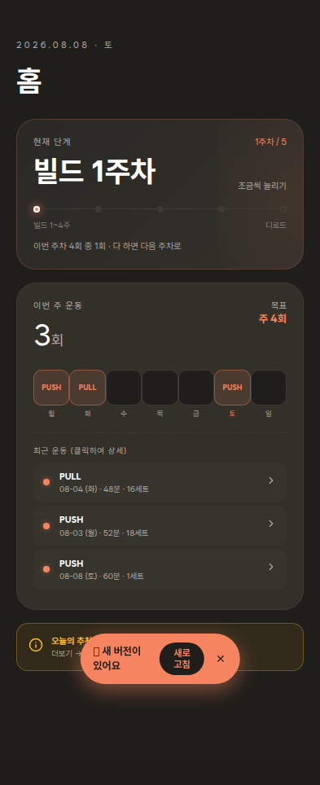

| # | 문제 | 근거 | 심각도 |
|---|---|---|---|
| H1 | **같은 "운동 횟수"가 두 카드에서 다르게 나옴.** 사이클 카드는 "이번 주차 4회 중 1회", 아래 카드는 "이번 주 운동 3회 / 목표 주 4회" | 앞은 사이클 진행도, 뒤는 달력 주 기준 — 사용자는 둘 다 "이번 주"로 읽음 (`screens.js:69`, 주간 카드) | **높음** |
| H2 | "1주차"가 한 카드 안에 두 번 (제목 "빌드 1주차" + 오른쪽 "1주차 / 5") | 스크린샷 상단 카드 | 중간 |
| H3 | 화면 제목 "홈"이 탭바 `HOME`과 중복. 날짜 줄까지 합쳐 **146px**를 씀 | `screens.js:105-110` | 중간 |
| H4 | "최근 운동 **(클릭하여 상세)**" — 안내 문구가 군더더기이고, '클릭'은 PC 용어 | `screens.js:151` | 중간 |
| H5 | **최근 운동 순서가 뒤섞임**: 08-04 → 08-03 → 08-08 (오늘이 맨 아래) | 저장은 최신 먼저(`unshift`)인데 표시는 `slice(-3).reverse()` (`screens.js:152`, `1616`) | **높음** |
| H6 | 요일 칩 7개 + 최근 운동 3줄 + 사이클 점 5개 — 한 화면에 진행도 표현이 3가지 | 스크린샷 | 중간 |

### 3-2. 운동 — 부위 선택 `02-workout.png`

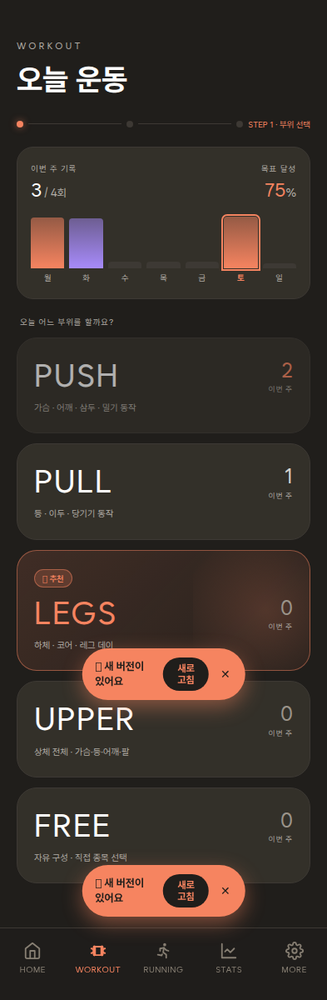

| # | 문제 | 근거 | 심각도 |
|---|---|---|---|
| W1 | **같은 사실을 두 번**: "3 / 4회"와 "목표 달성 **75%**" | 상단 카드 (`screens.js:418`, `422`) | 중간 |
| W2 | "오늘 어느 부위를 할까요?" — 라벨 자리에 대화체 질문 | `screens.js:430` | 중간 |
| W3 | 부위 카드 5개 모두 "0 / 이번 주" 뱃지를 달아, **0이 4번 반복** | 스크린샷 | 낮음 |
| W4 | 영어 대문자 제목(PUSH·PULL·LEGS·UPPER·FREE) + 영어 눈썹글씨(`WORKOUT`) + 영어 탭바 — 한국어 앱에 영어 라벨이 3중으로 겹침 | 스크린샷 | 중간 |
| W5 | `STEP 1 · 부위 선택` 진행 표시가 영어+한국어 혼용 | 스크린샷 | 낮음 |

### 3-3. 루틴 분석 — `03-workout-step2.png`

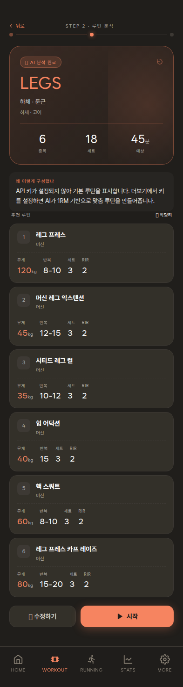

| # | 문제 | 근거 | 심각도 |
|---|---|---|---|
| R1 | **모순**: "✨ AI 분석 완료" 배지가 붙어 있는데, 바로 아래 본문은 "API 키가 설정되지 않아 **기본 루틴을 표시합니다**" | 배지가 조건 없이 항상 출력됨 (`screens.js:1136` vs `499`) | **높음** |
| R2 | 종목 카드 6개가 **"무게 / 반복 / 세트 / RIR" 머리글을 6번 반복** (총 24개 라벨) | 스크린샷 | **높음** |
| R3 | "세트 3", "RIR 2"가 6줄 모두 동일 — 같은 값이 12번 반복 | 스크린샷 | 중간 |
| R4 | 헤더에 부제가 두 줄 겹침("하체 · 둔근" / "하체 · 코어") | 스크린샷 | 낮음 |
| R5 | 강도 칩이 이모지 신호등(🟢 가볍게 / 🟡 적당히 / 🔴 도전) | `screens.js:1080-1082` | 중간 |

### 3-4. 루틴 수정 / 자유 구성 — `04-workout-step3-modify.png`, `09-free-routine.png`

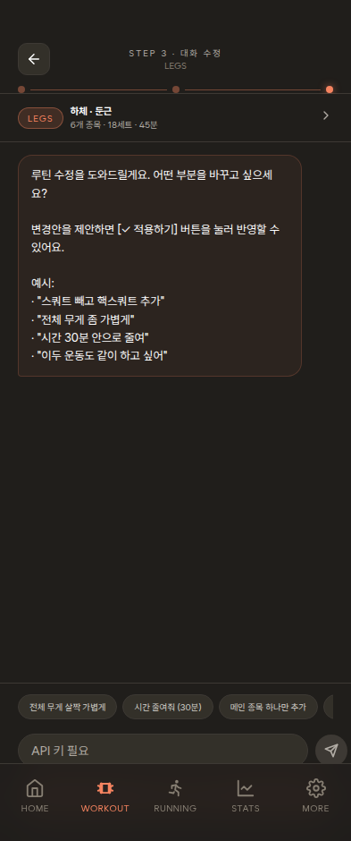

| # | 문제 | 근거 | 심각도 |
|---|---|---|---|
| C1 | **예시가 두 번**: 말풍선 안에 예시 4줄, 바로 아래에 같은 내용의 퀵 버튼 | `screens.js:585`(155자), `474`(170자) | **높음** |
| C2 | 전형적인 AI 말투 — "루틴 수정을 **도와드릴게요**", "자유롭게 **말씀해주세요**" | 위와 동일 | **높음** |
| C3 | 한 말풍선 안에서 말투가 섞임 — "…할게요"(해요체) + "…반영됩니다"(합니다체) | `screens.js:474` | 중간 |
| C4 | 안내가 화면의 40%를 차지하고 나머지는 빈 공간 | 스크린샷 | 중간 |

### 3-5. 러닝 — `05-running.png`, `06-running-plan.png`, `07-running-session.png`, `08-running-rpe.png`

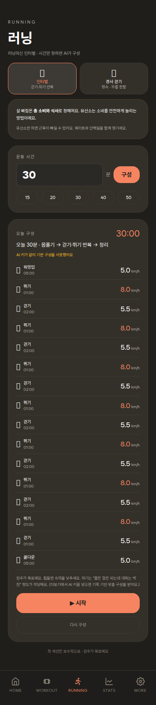

| # | 문제 | 근거 | 심각도 |
|---|---|---|---|
| N1 | 구간 리스트가 **17줄**. "뛰기 1:00 / 걷기 2:00"이 6번 반복되는데 전부 펼쳐 보여줌 | `06-running-plan.png` | **높음** |
| N2 | 같은 말이 위·아래 두 번: 본문 "완주가 목표예요…"(`5309`)와 최하단 각주 "첫 세션은 보수적으로 · 완주가 목표예요"(`5943`) | 코드 2곳 | 중간 |
| N3 | 교육 문구가 항상 펼쳐져 있음(2문단) — 매번 볼 필요 없음 | `screens.js:5857` | 중간 |
| N4 | 시간 입력칸 `예: 30`과 프리셋 칩(15·20·30·40·50)이 기능 중복 | `05-running.png` | 낮음 |
| N5 | 러닝에만 쓰이는 **초록 `#34d399`가 4곳**(이동거리·걷기 막대·기록 점) — 앱이 정해둔 초록(`--success #22c55e`)과 다른 색 | `screens.js:6046`, `6160`, `6169` | 중간 |
| N6 | RPE 버튼이 **4색 신호등**(초록/주황/앰버/빨강). 안내는 "4~6 적당"인데 4~6이 주황이라 경고처럼 읽힘 | `screens.js:6069` (색 분기), `6118` (안내) | 중간 |
| N7 | 완료 화면에 🎉/👏 이모지 44px + "완주!"/"수고했어요" | `screens.js:6108` | 중간 |

### 3-6. 운동 세션 — `10-session-active.png` 외

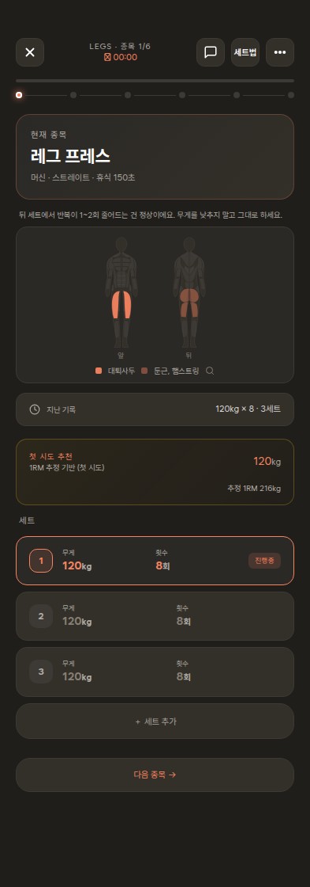

| # | 문제 | 근거 | 심각도 |
|---|---|---|---|
| S1 | **무게가 3개 동시에 보임**: 지난 기록 120kg / 첫 시도 추천 120kg / 추정 1RM 216kg. 어느 걸 들어야 하는지 헷갈림 | 스크린샷 | **높음** |
| S2 | "첫 시도 추천" 밑에 "1RM 추정 기반 **(첫 시도)**" — '첫 시도'가 두 번 | 스크린샷 | 낮음 |
| S3 | 카드가 8겹으로 쌓임(현재 종목 / 팁 문장 / 근육맵 / 지난 기록 / 추천 / 세트3 / 세트 추가 / 다음 종목) | 박스 23개 실측 | 중간 |
| S4 | 팁 문장("뒤 세트에서 반복이 1~2회 줄어드는 건 정상이에요…")만 카드 밖에 떠 있어 정렬이 어긋남 | `10-session-active.png` | 낮음 |
| S5 | 근육맵 카드가 세로 200px를 쓰는데 담긴 정보는 "가슴·삼두" 두 단어 | 스크린샷 | 중간 |
| S6 | 종목 교체 시트: "교체 →"가 모든 줄에 반복(6회+), 상단 안내문 2줄 | `13-exercise-swap.png`, `screens.js:2518` | 중간 |
| S7 | 세트 사이 코치: 안내문 2줄이 화면 대부분 | `15-session-chat.png`, `screens.js:2886` | 중간 |
| S8 | 세트법 시트 안내에 논문 인용("Angleri 2017")과 격식체 혼용 | `18-set-scheme.png` | 낮음 |

### 3-7. 세션 완료 — `17-session-complete.png`

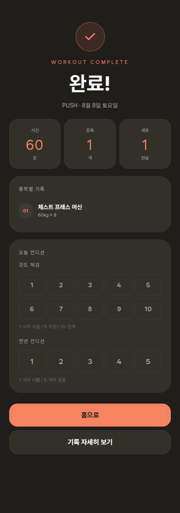

| # | 문제 | 근거 | 심각도 |
|---|---|---|---|
| F1 | 제목이 두 겹 — 영어 눈썹글씨 `WORKOUT COMPLETE` + 한국어 "완료!" | 스크린샷 | 중간 |
| F2 | 느낌표 + 체크 원형 + 색종이(confetti) 5색 애니메이션까지 축하 연출 3중 | `screens.js:3125` — 색 배열 `--accent`, `#fbbf24`, `#34d399`, `#f472b6`, `#a78bfa` (분홍은 앱 어디에도 안 쓰는 색) | 중간 |
| F3 | 컨디션 입력 버튼이 **15개**(1~10 + 1~5) + 설명 2줄 | 스크린샷 | 중간 |

### 3-8. 기록 (가장 복잡한 화면) — `30-stats.png`

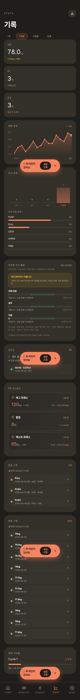

| # | 문제 | 근거 | 심각도 |
|---|---|---|---|
| T1 | **3.6화면 길이에 카드 51개.** 스크롤 끝이 안 보임 | 실측 3,417px | **높음** |
| T2 | 요약 3개(체중·PR·운동)가 각각 큰 카드 한 장씩 = 400px. 완료 화면처럼 **한 줄 3칸**이면 120px | 스크린샷 | **높음** |
| T3 | "세션 타입 분포"에 **0회 항목 3개**가 빈 막대로 자리만 차지 | 스크린샷 | 중간 |
| T4 | "부위별 주간 볼륨" 한 블록에 설명이 4겹(범례 1줄 + 노란 경고카드 2줄 + 부위별 부연 + 마무리 1줄), 정작 데이터는 막대 3개 | 스크린샷 | **높음** |
| T5 | **체중 기록 10줄**이 거의 같은 값(78kg, 78.1kg…)으로 나열 — 위의 체중 그래프와 중복 | 스크린샷 | **높음** |
| T6 | "클릭하여 상세 보기 / 삭제" 안내가 목록마다 반복(2회), '클릭'은 PC 용어 | `screens.js:4935`, `4962` | 중간 |
| T7 | 맨 아래 "현재 사이클" 카드가 **홈 화면 사이클 카드와 중복** | `30-stats.png` + `01-home.png` | 중간 |
| T8 | 유산소 요약의 3칸 라벨("총 분 / 총 km / 완주")이 서로 붙어 읽힘 | `30-stats.png` 2번째 슬라이스 | 중간 |
| T9 | 운동 기록 순서도 홈과 같은 이유로 뒤섞임 | `screens.js:4937` | **높음** |

### 3-9. 더보기 — `40-more.png`

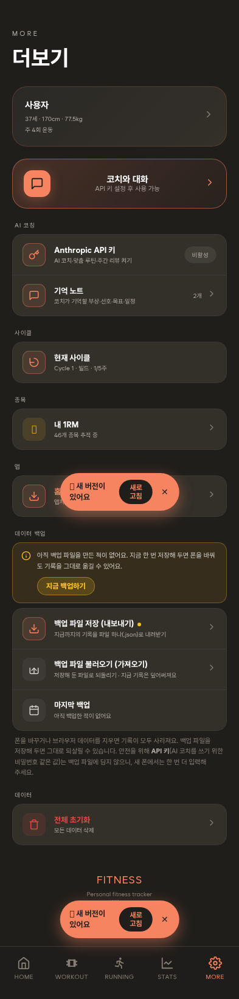

| # | 문제 | 근거 | 심각도 |
|---|---|---|---|
| M1 | 백업 설명이 **두 번**: 노란 경고 카드(2줄) + 아래 긴 문단(4줄). 내용이 겹침 | `screens.js:3612`, `3652` | **높음** |
| M2 | 그 문단 안에서 말투가 섞임 — "사라져요"(해요체) + "되살릴 수 있습니다"(합니다체) | `screens.js:3652` | 중간 |
| M3 | 섹션 제목이 7개(AI 코칭·사이클·종목·앱·데이터 백업·데이터…)라 목록이 잘게 쪼개짐 | 스크린샷 | 중간 |
| M4 | 하단 푸터 "FITNESS / Personal fitness tracker" — 영어 태그라인이 템플릿 느낌 | `screens.js:3862` | 낮음 |
| M5 | 아이콘 타일 색이 제각각(주황·빨강·갈색·연두)이라 위계가 없음 | 스크린샷 | 중간 |

### 3-10. 코치 대화 — `41-coach-chat.png`

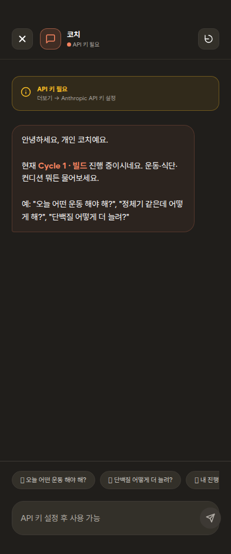

| # | 문제 | 근거 | 심각도 |
|---|---|---|---|
| K1 | **"API 키 필요"가 한 화면에 3번** (헤더 점 + 노란 카드 + 입력창 placeholder) | 스크린샷 | **높음** |
| K2 | 인사말 예시 3개와 하단 퀵칩이 **글자까지 동일** | `screens.js:3967` + 퀵칩 배열 | **높음** |
| K3 | "안녕하세요, 개인 코치예요." — 매번 인사 | 코드 동일 | 중간 |
| K4 | 퀵칩마다 이모지(💪🍗📈⚠️😴) | 퀵칩 배열 | 중간 |

### 3-11. 내 1RM — `42-onerm-list.png`

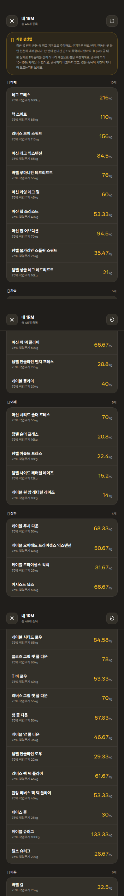

| # | 문제 | 근거 | 심각도 |
|---|---|---|---|
| O1 | 목록 위 설명이 **7줄**(자동 갱신 4줄 + ※ 주의 3줄) | `screens.js:3453`, `3456` | **높음** |
| O2 | 46개 종목 **전부** 숫자를 앰버색으로 강조 → 강조가 사라짐 | 스크린샷 | **높음** |
| O3 | 소수점 2자리(53.33kg, 35.47kg) — 헬스장에서 쓸 수 없는 정밀도 | 스크린샷 | 중간 |
| O4 | 모든 줄에 "75% 작업무게 …" 부연이 붙어 46번 반복 | 스크린샷 | 중간 |
| O5 | 설명 안에서 말투 혼용 — "내려갑니다" + "않아요" | `screens.js:3453` | 낮음 |

### 3-12. 잘 되어 있는 곳 (건드리지 말 것)

| 화면 | 좋은 점 |
|---|---|
| 프로필 수정 `45-profile-edit.png` | 라벨-입력-버튼만. 설명 문구 0줄. **이 앱이 가야 할 기준** |
| 확인 팝업 `16-confirm-dialog.png` | 한 문장 + 버튼 2개. 군더더기 없음 |
| 기록 상세 시트 `31-item-detail.png` | 제목·3칸 요약·목록·삭제. 깔끔 |
| 세트 편집 `11-set-editor.png` | 큰 숫자 + ±버튼. 손가락 조작에 맞음 |
| 근육맵 확대 `12-muscle-zoom.png` | 목적이 분명하고 장식이 없음 |

---

## 4. 제안 목록 — [삭제] / [수정] / [추가]

> 표기: **[삭제]** 없애기 · **[수정]** 바꾸기 · **[추가]** 새로 넣기
> 문구는 **before → after**로 적었습니다.

### 4-1. 전 화면 공통 (효과가 가장 큼)

| 태그 | 대상 | 구체안 | 예상 효과 |
|---|---|---|---|
| **[삭제]** | UI 이모지 87곳 | ✨🟡🔴🎉👏🏆📊💪🍗📈😴🦵💥🔙🩹🔁 등을 **모두 제거**. 뜻이 필요한 자리만 기존 SVG 아이콘으로 교체(🏆→`trophy`, ✓→`check`, ⚠️→`info`+`--warn` 색) | "AI가 만든 화면" 느낌의 **가장 큰 원인 제거**. 기기별 이모지 글꼴 차이도 사라짐 |
| **[삭제]** | 화면 제목 블록(5탭) | `홈`·`오늘 운동`·`러닝`·`기록`·`더보기` 큰 제목과 영어 눈썹글씨(`HOME`·`STATS`…) 삭제. 날짜만 작게 남김 | 화면마다 **146px 확보**(첫 카드가 바로 보임). 탭바와의 중복 제거 |
| **[수정]** | 10px 잔글씨 150곳 | 30%는 삭제, 남는 것은 **11px + `--text-muted`** 하나로 통일. "설명"은 카드당 최대 1줄 | 위계가 살아나 **큰 숫자가 먼저** 읽힘 |
| **[수정]** | 코드에 박은 색 57곳 | `#34d399`·`#10b981`·`#f472b6`·`#f87171` 제거 → `--accent`/`--warn`/`--danger`/`--success` 4개만 사용 | 초록이 3종에서 1종으로. 색이 의미를 되찾음 |
| **[수정]** | 격식체 19곳 | "…합니다/…됩니다" → "…해요/…돼요"로 통일 | 앱 전체가 한 사람이 쓴 글처럼 읽힘 |
| **[추가]** | 긴 설명 7곳 | 첫 줄만 남기고 나머지는 `info` 아이콘을 눌렀을 때 펼치기 | 설명은 살리되 화면은 조용해짐 |

### 4-2. 문구 정리 (before → after)

| 태그 | 위치 | before | after |
|---|---|---|---|
| **[수정]** | 코치 첫 인사 | `안녕하세요, 개인 코치예요.\n\n현재 Cycle 1 · 빌드 진행 중이시네요. 운동·식단·컨디션 뭐든 물어보세요.\n\n예: "오늘 어떤 운동 해야 해?", "정체기 같은데 어떻게 해?", "단백질 어떻게 더 늘려?"` | `Cycle 1 · 빌드 진행 중이에요. 운동·식단·컨디션 뭐든 물어보세요.` *(예시 3줄은 아래 퀵칩과 중복이라 삭제)* |
| **[수정]** | 루틴 수정 안내 | `루틴 수정을 도와드릴게요. 어떤 부분을 바꾸고 싶으세요?\n\n변경안을 제안하면 [✓ 적용하기] 버튼을 눌러 반영할 수 있어요.\n\n예시: · "스쿼트 빼고…" (4줄)` | `어디를 바꿀까요? 제안이 오면 [적용하기]로 반영돼요.` |
| **[수정]** | 자유 구성 안내 | `오늘 어떤 운동을 하고 싶으세요? 자유롭게 말씀해주세요.\n\n예를 들어: (4줄)\n\n원하는 부위, 시간, 강도를 알려주시면 루틴을 제안할게요. [✓ 적용하기] 버튼으로 반영됩니다.` | `부위·시간·강도를 알려 주세요.` |
| **[삭제]** | 종목 교체 안내 | `검색 없이는 같은 부위 종목을 보여줘요. 검색하면 전체 종목에서 찾고, 없는 종목은 이름 그대로 추가할 수 있어요.` | *(삭제)* 검색창 placeholder를 `종목 검색 — 없으면 그대로 추가`로 |
| **[수정]** | 세트 사이 코치 | `지금 하는 운동에 대해 물어보세요 — 자세, 무게 판단, 통증, 자극 등. 통증·자극을 말하면 기록으로 남겨 다음 추천에 반영해요.` | `자세·무게·통증, 뭐든 물어보세요.` *(기록 안내는 실제 기록될 때 토스트로)* |
| **[수정]** | 1RM 설명 | 7줄(자동 갱신 4줄 + ※ 3줄) | `최근 기록으로 계산한 추정값이에요. 종목끼리 비교하지 말고, 같은 종목이 오르는지만 보세요.` *(나머지는 ⓘ 안에)* |
| **[수정]** | 백업 설명 | 경고 카드 2줄 + 아래 문단 4줄 | 문단 삭제, 카드만: `폰을 바꾸거나 브라우저 기록을 지우면 데이터가 사라져요. 백업 파일로 옮길 수 있어요.` + 작게 `(API 키는 백업에 포함되지 않아요)` |
| **[수정]** | 홈 최근 운동 | `최근 운동 (클릭하여 상세)` | `최근 운동` |
| **[삭제]** | 기록 목록 안내 | `클릭하여 상세 보기 / 삭제` ×2 | *(삭제)* — 오른쪽 `>` 아이콘으로 충분 |
| **[수정]** | 부위 선택 라벨 | `오늘 어느 부위를 할까요?` | `부위 선택` |
| **[삭제]** | 완료 화면 | `WORKOUT COMPLETE` (영어 눈썹글씨) | *(삭제)* — 아래 "완료"만 |
| **[수정]** | 완료 화면 제목 | `완료!` | `완료` *(느낌표 제거)* |
| **[수정]** | 러닝 각주 | 본문 `완주가 목표예요…` + 최하단 `첫 세션은 보수적으로 · 완주가 목표예요` | 최하단 각주 **삭제**(중복) |
| **[삭제]** | 더보기 푸터 | `FITNESS / Personal fitness tracker` | *(삭제)* — `버전 v47`만 |

### 4-3. 화면별 구조 정리

| 태그 | 화면 | 구체안 | 예상 효과 |
|---|---|---|---|
| **[수정]** | 홈 | 사이클 카드의 "이번 주차 4회 중 1회"와 주간 카드의 "3회/주 4회" 중 **하나만** 남기기(사이클 기준 권장) | 가장 큰 혼란 요소 제거 |
| **[삭제]** | 홈 | 사이클 카드 오른쪽 "1주차 / 5" 뱃지(제목에 이미 있음) | 중복 제거 |
| **[삭제]** | 기록 | 맨 아래 "현재 사이클" 카드(홈과 중복) | 카드 1개 감소 |
| **[수정]** | 기록 | 요약 3카드(체중·PR·운동) → **한 줄 3칸**(완료 화면 스타일) | 약 280px 절약 |
| **[수정]** | 기록 | 체중 기록 10줄 → **최근 3줄 + "더 보기"** | 약 500px 절약, 위 그래프와 중복 해소 |
| **[삭제]** | 기록 | 세션 타입 분포에서 0회 항목 숨기기 | 빈 막대 3개 제거 |
| **[수정]** | 기록 | 부위별 볼륨: 설명 4겹 → 범례 1줄만. 경고 카드는 ⓘ로 | 블록 높이 절반 |
| **[수정]** | 기록 | 유산소 3칸 라벨이 붙는 문제 — 칸마다 최소 너비 주기 | 읽히지 않던 라벨이 읽힘 |
| **[수정]** | 루틴(STEP2) | 무게/반복/세트/RIR **머리글은 목록 맨 위 1번만**, 카드 안엔 값만 | 라벨 24개 → 4개 |
| **[수정]** | 루틴(STEP2) | ✨ AI 분석 완료 배지를 **AI가 실제로 만들었을 때만** 표시. 폴백이면 "기본 루틴" | 앱이 거짓말하지 않게 됨 |
| **[수정]** | 세션 | 무게 3종(지난 기록·추천·추정 1RM) → **추천 1개를 크게**, 나머지는 한 줄로 합치기 | "얼마 들지"가 한눈에 |
| **[수정]** | 세션 | 근육맵 카드 기본은 **접힌 상태**(현재 종목 카드 안 작은 그림), 누르면 확대 | 200px 절약 |
| **[삭제]** | 세션 | 종목 교체 목록의 "교체 →" 반복 | 줄마다 반복되던 글자 제거 |
| **[수정]** | 러닝 | 구간 17줄 → **요약 3줄**(`워밍업 5분` / `뛰기 1분 · 걷기 2분 × 6회` / `쿨다운 5분`) + "자세히" 펼치기 | 화면 1.9 → 1.0 |
| **[수정]** | 러닝 | 교육 문구 2문단 → 첫 문장만, 나머지 ⓘ | 첫 화면이 조용해짐 |
| **[수정]** | 러닝 | RPE 4색 → **회색 1색 + 선택 시 강조색**. 색 대신 숫자와 라벨로 구분 | 신호등 색 남용 제거 |
| **[삭제]** | 완료 | confetti 5색 애니메이션 | 축하는 체크 아이콘 하나로 충분 |
| **[수정]** | 완료 | 컨디션 버튼 15개(강도 체감 1~10 + 전반 컨디션 1~5) → **1~5 한 줄 하나로 통합**. 설명 2줄은 양 끝 라벨(`쉬움`·`힘듦`)로 대체 | 버튼 15 → 5, 설명 2줄 → 0 (`screens.js:3182-3191`) |
| **[수정]** | 1RM | 숫자 색을 흰색으로, **상위 5개만** 강조색 | 강조가 강조 역할을 되찾음 |
| **[수정]** | 1RM | 소수점 반올림(53.33 → 53) | 헬스장에서 쓸 수 있는 숫자 |
| **[삭제]** | 코치 | "API 키 필요" 3중 표시 → 노란 카드 1개만 | 같은 말 3번 → 1번 |
| **[추가]** | 주간 리뷰 | API 키 없을 때 `API 키가 필요해요.`만 뜨고 끝 → **"키 설정하러 가기" 버튼** 추가 | 막다른 길 해소 |
| **[수정]** | 더보기 | 섹션 7개 → **3개**(AI · 내 데이터 · 앱)로 묶기 | 목록이 덜 잘게 쪼개짐 |
| **[수정]** | 더보기 | 아이콘 타일 색 통일(전부 회색, 위험한 것만 빨강) | 시선이 "전체 초기화"로만 감 |

---

## 5. 공통 디자인 규칙 (제안)

### 5-1. 이모지 사용 원칙

1. **기본 UI에 이모지를 쓰지 않는다.** 아이콘이 필요하면 앱이 이미 가진 SVG 아이콘 31종에서 고른다.
2. 아이콘 세트에 없으면 **아이콘 없이 글자만** 쓴다. (새 이모지를 넣지 않는다)
3. 경고·주의는 이모지(⚠️) 대신 **`--warn` 색 + `info` 아이콘**으로 표시한다.
4. 예외는 **사용자가 고른 값을 되비출 때 하나**만 허용한다(예: 컨디션 선택 결과). 앱이 스스로 붙이는 장식용 이모지는 금지.
5. 축하 연출은 **화면당 1개**까지(체크 아이콘 또는 색종이 중 하나).

### 5-2. 강조색 사용 원칙

1. 색은 **4개만** 쓴다: `--accent`(주황) · `--warn`(앰버) · `--danger`(빨강) · `--success`(초록). 코드에 색을 직접 적지 않는다.
2. **주황은 "지금 눌러야 할 버튼 1개 + 지금 중요한 숫자 1개"까지.** 라벨·부연·목록 숫자에는 쓰지 않는다.
3. 목록 전체를 같은 색으로 칠하지 않는다(1RM 46개 전부 앰버 → 흰색, 상위 몇 개만 강조).
4. 앰버(`--warn`)는 **사용자가 조치해야 할 때만.** 단순 안내에는 회색을 쓴다.
5. **화면당 강조색 글자 6개 이하**를 목표로 한다. (현재 기록 탭 16개)

### 5-3. 문구 톤 가이드 (5줄)

1. **해요체로 통일한다.** "…합니다/…됩니다"를 섞지 않는다.
2. **한 문장 40자 이내**, 안내는 카드당 1줄. 더 필요하면 ⓘ로 접는다.
3. **앱이 자기 행동을 설명하지 않는다.** "도와드릴게요", "만들어줍니다", "표시합니다" → 사용자가 할 일만 적는다.
4. **느낌표·감탄·칭찬 수식어를 쓰지 않는다.** 칭찬은 사실로 대신한다("3세트 완료").
5. **예시는 본문에 쓰지 않는다.** 버튼(칩)이나 입력칸 placeholder로 보여준다.

---

## 6. 우선순위 Top 10 (효과 대비 작업량)

| 순위 | 할 일 | 효과 | 작업량 | 왜 이 순서인가 |
|---:|---|:---:|:---:|---|
| 1 | **이모지 전면 제거 → SVG 아이콘 통일** (87곳) | 매우 큼 | 중 | "AI 티"의 가장 큰 원인. 찾아 바꾸기라 위험이 낮음 |
| 2 | **말풍선 예시 삭제**(코치·루틴 수정·자유 구성 3곳) — 아래 퀵칩과 중복 | 큼 | 소 | 문구 3개만 줄이면 화면이 확 비워짐 |
| 3 | **"AI 분석 완료" 배지 조건부로 수정** | 큼(신뢰) | 소 | 배지와 본문이 서로 반대말을 함. 한 줄 조건만 넣으면 해결 |
| 4 | **화면 제목 블록 삭제**(5탭, 146px 회수) | 큼 | 소 | 탭바와 중복. 첫 카드가 바로 보임 |
| 5 | **기록 탭 다이어트**(요약 3칸 통합 + 체중 목록 접기 + 0회 숨김 + 사이클 카드 삭제) | 매우 큼 | 중 | 3.6화면 → 약 2화면. 가장 복잡한 화면이 정리됨 |
| 6 | **강조색 정리**(코드에 박은 색 57곳 → 토큰 4개, 1RM 목록 흰색화) | 큼 | 중 | 색이 의미를 되찾아 "중요한 것"이 보임 |
| 7 | **긴 안내문 7건 요약 + ⓘ 접기**(1RM·백업·러닝·볼륨·교체·세션챗) | 큼 | 소 | 문구 교체만으로 잔글씨가 크게 줄어듦 |
| 8 | **말투 통일**(격식체 19곳 → 해요체) | 중 | 소 | 한 사람이 쓴 앱처럼 읽힘 |
| 9 | **루틴 카드 머리글 1회로**(라벨 24 → 4) + 세션 무게 3종 → 1종 | 중 | 중 | 반복 라벨 제거, "얼마 들지"가 명확해짐 |
| 10 | **기록 정렬 버그 수정**(홈·기록) | 중(신뢰) | 소 | 한 줄 수정(`slice(-N).reverse()` → `slice(0,N)`) |

---

## 7. 부록 — 감사 중 발견한 실제 결함 (디자인 밖, 참고용)

디자인 제안과 별개로, **동작이 틀린 곳**을 발견해 함께 적습니다. 고칠지는 별도로 판단해 주세요.

| # | 내용 | 위치 | 확인 방법 |
|---|---|---|---|
| B1 | **운동 기록 정렬 오류.** 저장은 최신 먼저(`unshift`)인데 표시는 `slice(-N).reverse()` → 기록이 10개를 넘으면 **가장 오래된 것만** 목록에 남음 | `screens.js:152`(홈), `4937`(기록), `1616`(저장) | 실측 데이터 `["2026-08-08","2026-08-03","2026-08-04"]`가 화면에는 08-04 → 08-03 → 08-08 순으로 표시됨 |
| B2 | **"✨ AI 분석 완료" 배지가 항상 표시** — API 키가 없어 기본 루틴을 보여줄 때도 붙음 | `screens.js:1136` (조건 없음) vs `499` | `03-workout-step2.png` |
| B3 | **주간 리뷰 막다른 길** — API 키가 없으면 "API 키가 필요해요."만 뜨고 설정으로 갈 방법이 없음 | 주간 리뷰 화면 | `46-weekly-review.png` |
| B4 | **유산소 요약 3칸 라벨 붙음** — "총 분 / 총 km / 완주"가 이어져 읽힘 | `screens.js:6183` 부근 | `30-stats.png` 2번째 화면 |
| B5 | **없는 탭 이름을 넣으면 빈 화면** — `setTab('fuel')` 같은 옛 탭 id에서 아무것도 그리지 않음(현재 UI로는 도달 불가) | `render()` 라우팅 | 감사 중 재현 |
| B6 | **문서 불일치** — `CLAUDE.md`는 "연료(음식) 탭"과 5개 탭 구성을 설명하지만, 실제 앱에는 음식 기능이 없음 | `CLAUDE.md` | 라이브 탭바 확인 |

---

## 8. 스크린샷 목록

| 파일 | 화면 |
|---|---|
| `01-home.png` | 홈 |
| `02-workout.png` | 운동 — 부위 선택(STEP 1) |
| `03-workout-step2.png` | 운동 — 루틴 분석(STEP 2) |
| `04-workout-step3-modify.png` | 운동 — 대화로 수정(STEP 3) |
| `05-running.png` | 러닝 — 시작 화면 |
| `06-running-plan.png` | 러닝 — 구성 완료(인터벌 17구간) |
| `07-running-session.png` | 러닝 — 진행 중 |
| `08-running-rpe.png` | 러닝 — 종료 후 RPE |
| `09-free-routine.png` | 운동 — FREE(자유 구성) |
| `10-session-active.png` | 운동 세션 — 진행 중 |
| `11-set-editor.png` | 세트 편집 시트 |
| `12-muscle-zoom.png` | 자극 근육 확대 |
| `13-exercise-swap.png` | 종목 교체 시트 |
| `14-rest-timer.png` | 휴식 타이머 |
| `15-session-chat.png` | 세트 사이 코치 |
| `16-confirm-dialog.png` | 확인 팝업 |
| `17-session-complete.png` | 운동 완료 |
| `18-set-scheme.png` | 세트법 변경 시트 |
| `30-stats.png` | 기록(전체 3.6화면) |
| `31-item-detail.png` | 기록 상세 시트 |
| `40-more.png` | 더보기 |
| `41-coach-chat.png` | 코치와 대화 |
| `42-onerm-list.png` | 내 1RM(46종목) |
| `43-coach-memory.png` | 기억 노트 |
| `44-api-key.png` | API 키 설정 |
| `45-profile-edit.png` | 프로필 수정 |
| `46-weekly-review.png` | 주간 리뷰(키 없음 상태) |
